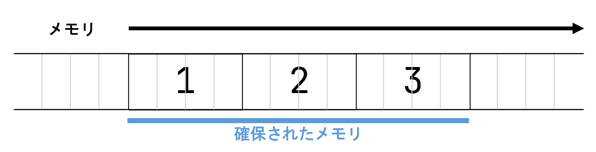
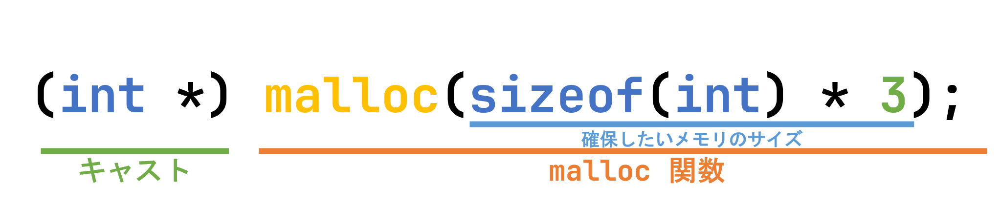
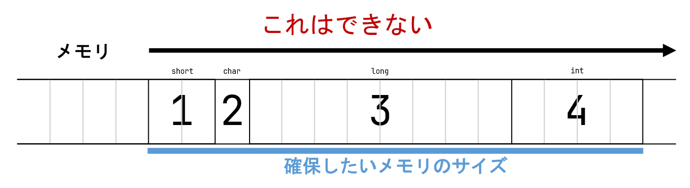
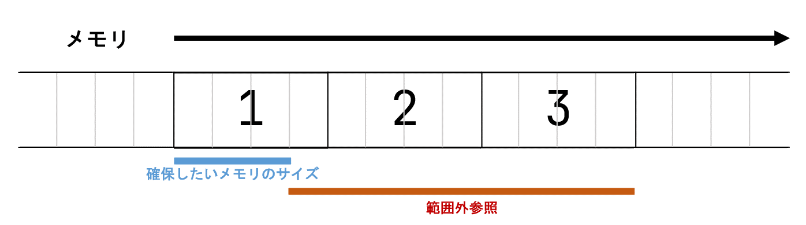
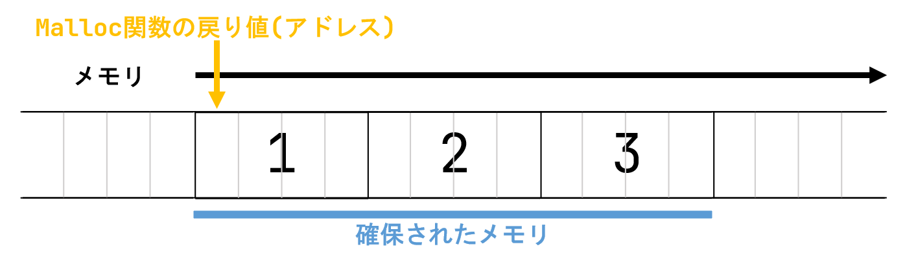
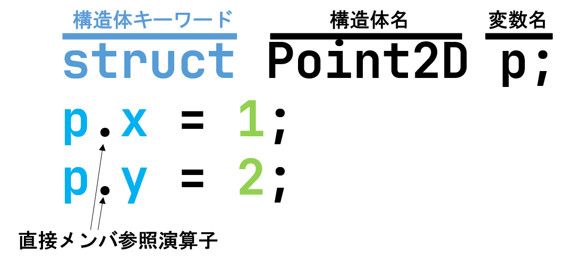

# MCC C言語部内講習会 第3回

## この講座の対象の人
 - MCC部員
 - C言語を初歩から学びたい人


**この後の内容をチラ見して内容を知っていそうだと判断できる人は次回以降の参加でも大丈夫です！**

## キャスト

キャストとは型変換です。以下に`double`, `float`, `int`, `long`のキャストの例を示します。

```c
#include <stdio.h>

int main() {
	double a = 1.5;
	float b = (float) a;
	int c = (int) b;
	long d = (long) c;

	printf("a = %lf\n", a);
	printf("b = %f\n", b);
	printf("c = %d\n", c);
	printf("d = %ld\n", d);
}
```
少数型を整数型にキャストしたら切り捨てされます。一部型では省略できます。
```c
#include <stdio.h>

int main() {
	double a = 1.5;
	float b = a;
	int c = b;
	long d = c;

	printf("a = %lf\n", a);
	printf("b = %f\n", b);
	printf("c = %d\n", c);
	printf("d = %ld\n", d);
}
```

## 動的配列
今回は動的配列について学びます。その前に、配列についてちょっとだけ復習をしておこうと思います。

### 配列
配列とは、**同じ型**のデータを連続に並べたものです。
今まで学んだ配列変数の定義の仕方として、次のようなものがありました。
```c
int main() {
	int arr[3] = {1, 2, 3};
}
```



このように配列を定義した場合、上の例における `arr` の長さ（サイズ）は `3` (4 × 3 = 12byte)で固定されており、範囲外は他のプロセスが使用しているため、後から伸長することは不可能です。

### 動的メモリ確保(malloc)
配列の長さ10個だけ必要なとき、100個だけ必要なとき、1000個だけ必要なとき...があると思います。予め1000個の長さの配列を作っても、10個だけしか使わなければ9990個は無駄になります。このような場面には、`malloc` 関数を用いて**動的**にメモリを確保します。`malloc`関数は引数で指定した分、メモリを確保し、確保したメモリのアドレスを返します。`malloc` 関数はヘッダファイル `stdlib.h` に定義されています。次に `malloc` 関数の使用例を示します。`#include <stdlib.h>`を忘れないでください。
```c
#include <stdlib.h>

int main() {
	int *arr = (int *)malloc(sizeof(int)*3);
}
```

上の例において、`int*` 型の変数 `arr` はint `3` 要素分のメモリを持っています。`sizeof`はsizeof演算子と言い、データ型の大きさを求める演算子です。ここではintの大きさを求めています。以下に型のサイズの例を示します。`arr` の長さ（サイズ）は `3` (4 × 3 = 12byte)で要素数3のint型配列と同じように扱えます。`malloc`関数は乱用ポインタ(`void*`)を返すので`int*`にキャスト(型変換)してください。

|type|ex.|result|
|--|--|:--:|
|char|sizeof(char)|1|
|short|sizeof(short)|2|
|int|sizeof(int)|4|
|long|sizeof(long)|8|

次のようにして、ユーザーの入力分だけのメモリを確保することも可能です。コンソールで10と入力すればnに10が入り、arrは要素数10のint型配列になります。
```c
#include <stdio.h>
#include <stdlib.h>

int main() {
	int n;		// 配列の要素数
	int *arr;	// 動的配列を割り当てるためのポインタ変数

	scanf("%d", &n); // ユーザーからの入力を受け取る
	arr = (int *)malloc(sizeof(int) * n);
}
```
さて、ここで `malloc` 関数について詳しく説明したいと思います。  
この関数の引数は、`size_t(unsigned int)` 型の、確保するメモリの Byte 数です。注意点として、C言語では型によってメモリのサイズが異なるため、異なる型を一つの配列に入れられないという点があります。具体例を次に示します。



また、変数のサイズを忘れ、以下の誤りをよく発生します。注意してください。

```c
#include <stdlib.h>

int main() {
	int *arr = (int *)malloc(3); // int型3要素の配列を定義しようとした
	// int *arr = (int *)malloc(sizeof(int) * 3); 正しくはこう
	arr[0] = 12;
	arr[1] = 34;
	arr[2] = 56;
	// このデモでは発生しないが、意図しないメモリの値を書き換えてしまっている！
}
```


次に、返り値について説明します。`malloc` の返り値は、`void *` 型で、確保されたメモリの先頭のポインタで、何かしらのポインタを意味します。このポインタのアドレスを基準に、配列の内容にアクセスします。アクセスの方法は普通の配列と同様にできます。`void *`も`int *`も中身はアドレス(整数)であるため、キャストができ省略もできます。`void *`は`float *`にも`double *`にもキャストできます。



### 動的に確保したメモリの開放
さて、前項では述べませんでしたが、このように動的に確保したメモリ領域はプログラマが使い終わったタイミングで解放する処理も記述する必要があります。不要なメモリを開放して挙げないと、コンピューターのメモリを使い切ってしまいます。メモリを確保して、不要になっても確保されたままだからです。不要なメモリを解放するために、`free` 関数を使います。利用方法としては、確保したポインタを `free` 関数に渡すことで実行することができます。次に例を示します。

```c
#include <stdio.h>
#include <stdlib.h>

int main() {
	int *arr = (int *)malloc(sizeof(int) * 3);	// メモリ確保
	arr[0] = 12;
	arr[1] = 34;
	arr[2] = 56;
	for (int i = 0; i < 3; ++i) {
		printf("%d\n", arr[i]);
	}
	free(arr);	// メモリ解放
}
```

このようにして、動的に確保したメモリ領域を解放することができます。  
注意点として、一度解放したメモリ領域をもう一度解放しようとするとエラーが発生します。
```c
#include <stdlib.h>

int main() {
	int *arr = (int *)malloc(sizeof(int) * 3);
	free(arr);
	free(arr);	// 実行時にエラー発生
}
```

```
free(): double free detected in tcache 2
Aborted (core dumped)
```

また、一度解放したメモリ領域を参照しようとしてはいけません。メモリの内容が破壊される可能性があります。
```c
#include <stdio.h>
#include <stdlib.h>

int main() {
	int *arr = (int *)malloc(sizeof(int) * 3);
	arr[0] = 12;
	arr[1] = 34;
	arr[2] = 56;
	free(arr);
	// ↑で解放済みなのに↓で参照してしまった！
	printf("%d\n", arr[0]);
	// 佐藤の手元の環境では 0 が表示された
}
```

---

## 構造体
次に、構造体を紹介します。
構造体とは、異なる型のいくつかの情報をまとめて一つの型として管理するためのものです。変数の箱の中に変数の箱が入っているイメージです。例を見てみましょう。
```c
struct Point2D {
	int x, y;
};
```
上の例では、`int` 型のメンバ変数 `x`, `y` を持つ `Point2D` という構造体を**定義**しています。  
実際に `Point2D` 型の変数を宣言する際には次のように行います。
```c
struct Point2D {
	int x, y;
};

int main() {
	struct Point2D p;
}
```
また、`Point2D` の持つ メンバ変数`x`, `y` には次のように`.`でアクセスすることができます。
```c
#include <stdio.h>

struct Point2D {
	int x, y;
};

int main() {
	struct Point2D p;
	p.x = 1;
	p.y = 2;
	printf("p.x=%d, p.y=%d\n", p.x, p.y);
}
```


 
  
構造体を型として宣言(type definition)することで省略できます。下記の`typedef struct Point2D P2D;`は「`struct Point2D`を`P2D`とします。」という意味です。
```c
struct Point2D {
	int x, y;
};
typedef struct Point2D P2D;

int main(){
	P2D p2;
}
```
構造体の宣言とその構造体を型として宣言することを同時に行うこともできます。
```c
typedef struct Point3D {
	int x, y, z;
} P3D;

int main(){
	P3D p3;
}
```
構造体のタグ名と型名に全く同じ名前を付けることもできます。
```c
typedef struct Vec2D {
	int x, y;
} Vec2D;

int main(){
	Vec2D v2;
}
```
構造体が他の構造体をメンバに持つことも可能です。
```c
typedef struct Point2D {
	int x, y;
} P2D;

typedef struct Line2D {
	P2D from, to;
} Line2D;

int main(){
	Line2D l2;

	l2.from.x = 0;
	l2.from.y = 0;

	l2.to.x = 1;
	l2.to.y = 1;
}
```

構造体のポインタ変数を宣言することも可能です。  
構造体のポインタ変数からメンバ変数にアクセスする際には->(アロー)演算子を使います。
```c
#include <stdio.h>

typedef struct Point2D {
	int x, y;
} Point2D;

int main() {
	Point2D p;
	Point2D *poi;
	
	p.x = 12;
	p.y = 34;

	printf("p.x=%d, p.y=%d\n", p.x, p.y);
	poi = &p;
	
	// 構造体のポインタ変数からのメンバアクセスには
	// -> 演算子を使う
	printf("poi->x=%d, poi->y=%d\n", poi->x, poi->y);

	// これと同じ
	printf("poi->x=%d, poi->y=%d\n", (*poi).x, (*poi).y);
}
```

構造体のメモリを動的に確保することも可能です。ちなみに`Point2D`は`int`型の変数が2つあるので`sizeof(Point2D)`は`8`を返します。
```c
#include <stdio.h>
#include <stdlib.h>

typedef struct Point2D {
	int x, y;
} Point2D;


int main() {
	Point2D *p = (Point2D *)malloc(sizeof(Point2D) * 1);
	(*p).x = 12;
	printf("%d\n", (*p).x);
	p->x = 34;
	printf("%d\n", p->x);
	free(p);
}
```

構造体の配列も動的に生成できます。

```c
#include <stdio.h>
#include <stdlib.h>

typedef struct Point2D {
	int x, y;
} Point2D;


int main() {
	int length;

	printf("Input lenght: ");
	scanf("%d", &length);

	Point2D *p = (Point2D *)malloc(sizeof(Point2D) * length);
	
	for (int i = 0; i < length; i++){
		p[i].x = i;
		p[i].y = 2 * i;
	}

	for (int i = 0; i < length; i++){
		printf("p[%d].x = %d, p[%d].y = %d\n", i, p[i].x, i, p[i].y);
	}

	free(p);
}
```
```
Input lenght: 10
p[0].x = 0, p[0].y = 0
p[1].x = 1, p[1].y = 2
p[2].x = 2, p[2].y = 4
p[3].x = 3, p[3].y = 6
p[4].x = 4, p[4].y = 8
p[5].x = 5, p[5].y = 10
p[6].x = 6, p[6].y = 12
p[7].x = 7, p[7].y = 14
p[8].x = 8, p[8].y = 16
p[9].x = 9, p[9].y = 18
```
```
Input lenght: 5
p[0].x = 0, p[0].y = 0
p[1].x = 1, p[1].y = 2
p[2].x = 2, p[2].y = 4
p[3].x = 3, p[3].y = 6
p[4].x = 4, p[4].y = 8
```
